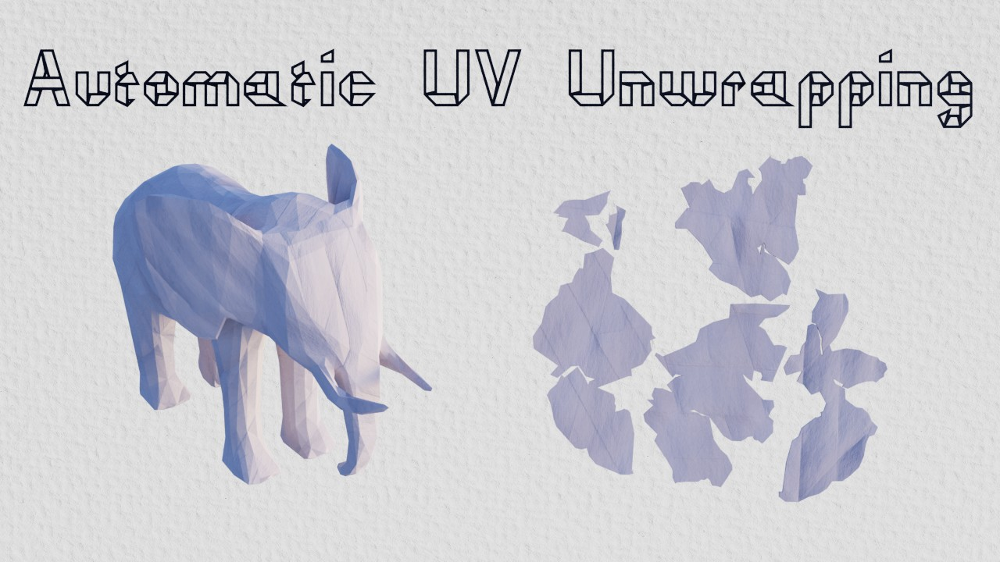
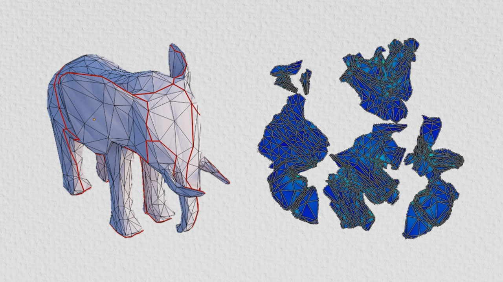
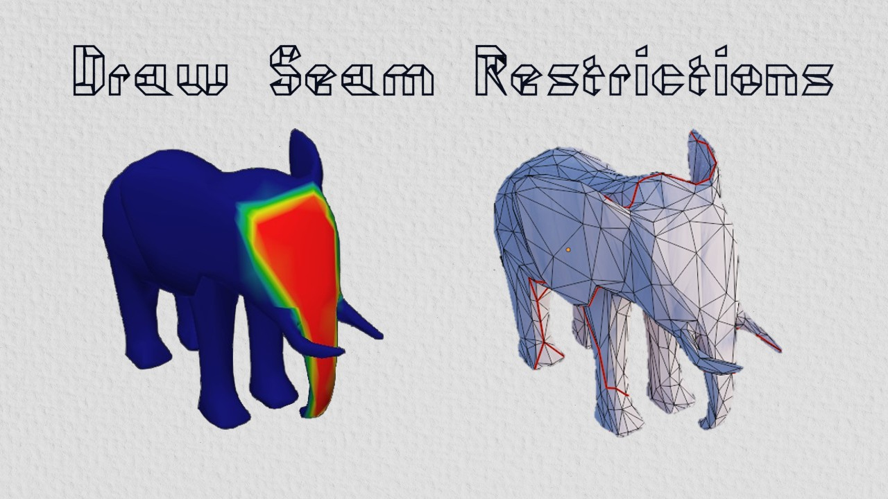
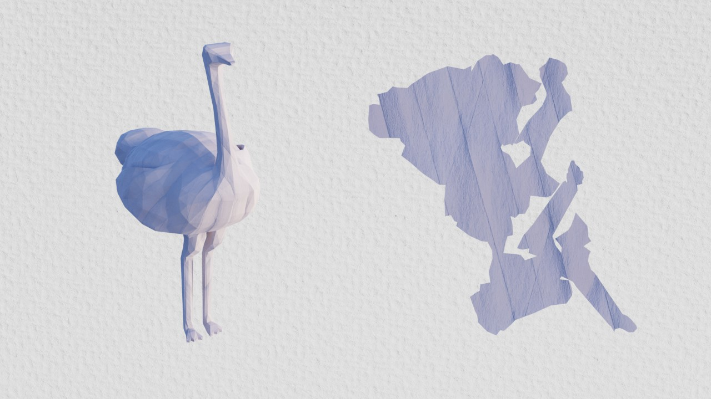

## Quickstart

> [!NOTE]
> Check the [user guide](docs/docs.md) for more detailed documentation.

[Find the latest release here](https://github.com/danielboxer/UVgami/releases/latest).

There are [three](#engines) supported engines.

### Install the add-on

1. Get the add-on: `UVgami.zip`
2. This comes with Optcuts and xatlas as bundled engines that will be auto detected

### Download PartUV engine after install

This is a different engine that requires an NVIDIA GPU. Install the add-on, then click `Install PartUV Engine` in the preferences.

## Engines

UVgami has three unwrapping engines, see the [docs](docs/docs.md) for more info:

- OptCuts (CPU): [OptCuts](https://github.com/liminchen/OptCuts) by Minchen Li et al. ([paper](https://www.cs.ubc.ca/labs/imager/tr/2018/OptCuts/))
- xatlas (CPU): [xatlas](https://github.com/jpcy/xatlas) by Jonathan Young
- PartUV (GPU): [PartUV](https://github.com/EricWang12/PartUV) by Zhaoning Wang et al. ([paper](https://arxiv.org/abs/2511.16659)). PartUV AI segmentation can't be used commercially (NVIDIA)
