# UVgami User Guide <!-- omit in toc -->

UVgami is a Blender add-on that allows you to automatically unwrap your meshes with a single button click.

Supported Operating Systems:

- Windows
- Linux
- Intel Mac
- Apple Silicon Mac

Blender 4.3+

## Table of Contents <!-- omit in toc -->

- [Installation](#installation)
- [General Instructions](#general-instructions)
  - [Unwrap a Mesh](#unwrap-a-mesh)
  - [Unwrap Settings](#unwrap-settings)
  - [Unwrap Buttons](#unwrap-buttons)
  - [Batch Unwrap](#batch-unwrap)
  - [Joined Objects](#joined-objects)
  - [Progress Bar](#progress-bar)
- [General Settings](#general-settings)
  - [Priority](#priority)
  - [Transfer UVs](#transfer-uvs)
  - [Speed](#speed)
    - [Concurrent mode](#concurrent-mode)
    - [Timeout](#timeout)
    - [Stack Similar](#stack-similar)
  - [Grid](#grid)
  - [Pack](#pack)
- [Engines](#engines)
  - [OptCuts](#optcuts)
    - [Visual Mode](#visual-mode)
    - [Import UVs](#import-uvs)
    - [Hard Surface](#hard-surface)
    - [Weights](#weights)
      - [Avoid Seams](#avoid-seams)
      - [Reduce stretching](#reduce-stretching)
      - [Generate Weights](#generate-weights)
      - [Strength](#strength)
    - [Proxy (in Speed panel)](#proxy-in-speed-panel)
    - [OptCuts Limitations](#optcuts-limitations)
  - [UV Editor Tools](#uv-editor-tools)
    - [Island Operators](#island-operators)
      - [Unwrap Island](#unwrap-island)
      - [Relax Island](#relax-island)
      - [Combine Islands](#combine-islands)
    - [Area Operators](#area-operators)
      - [Unwrap Area](#unwrap-area)
      - [Relax Area](#relax-area)
  - [PartUV](#partuv)
    - [Segmentation mode](#segmentation-mode)
  - [xatlas](#xatlas)
  - [Preferences](#preferences)
    - [Autosave](#autosave)
    - [Show Popup](#show-popup)
    - [Progress Bar Option](#progress-bar-option)
    - [Reset Settings](#reset-settings)

## Installation

1. Download `UVgami.zip`
2. Drag and drop the zip file into Blender
3. In Blender, press `Download Engine` in the n-panel

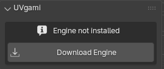

## General Instructions

### Unwrap a Mesh

1. Select a mesh
2. Press the `Unwrap` button

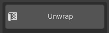

<!--

- If an unwrap is already active, you can still add new items to the queue

-->

### Unwrap Settings

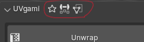

The top of the panel shows any current non default settings that affect the unwrap. This allows you to quickly see the active settings. You can click an icon to reset that setting.

### Unwrap Buttons

- Click the eye button to open the viewer and see the UVs update live
- Click the stop button to stop the unwrap and get the partly finished output.
- Click the cancel button to cancel the unwrap

### Batch Unwrap

- Pressing unwrap with more than one object selected will add them all to the unwrap queue

### Joined Objects

- If an object is made up of joined together objects, each piece of the object will be unwrapped separately and later joined together
- This will show up as a group in the ui

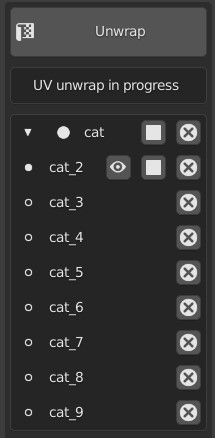

### Progress Bar

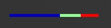

- The progress bar will appear in the bottom left corner of the 3D viewport
- For Optcuts engine, the colours correspond to the UV stretching in the current unwrap
  - Blue: Low stretching
  - Green: Medium stretching
  - Red: High stretching
- A progress bar with almost all blue doesn't necessarily mean that the unwrap will finish soon. Sometimes there is not much stretching, but the seams need adjustment to get the best result.
- For the other engines, the bar just represents the amount of meshes unwrapped

## General Settings

### Priority

- `Balanced`: Good balance between stretch and seam length.
- `Less Stretch`: Less stretch (distortion) in final UV map but more seams. Slowest option.
- `Fewer Seams`: Fewer seams in the final UV map but more stretching. Fastest option.

### Transfer UVs

This setting makes the finished uvs go onto the original object instead of a separate output mesh. It will overwrite the current UV map if there is one. Modifers will not be applied.

Use this settings if you want to keep quad topology. However note that the seams may be slightly worse if the original seams went through the middle of any quads.

If this setting is off, the original object will be hidden and the new unwrapped object will be put in a separate collection. Modifiers will be applied on the new object.

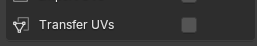

<!-- ### Symmetry

Use symmetry when you have a symmetrical mesh. The more axes selected, the faster the unwrap will be.

- Select multiple axes by holding `Shift`
- Deselect by holding `Shift`
- If `Merge` is turned on, the symmetrical UVs will overlap and merge. This is good if you want your texture mirrored. Turning `Merge` off will result in a seam down the set axes.
- Press preview to add a plane on the set axes. This is only for making sure you have selected the correct axes.

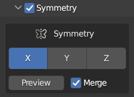

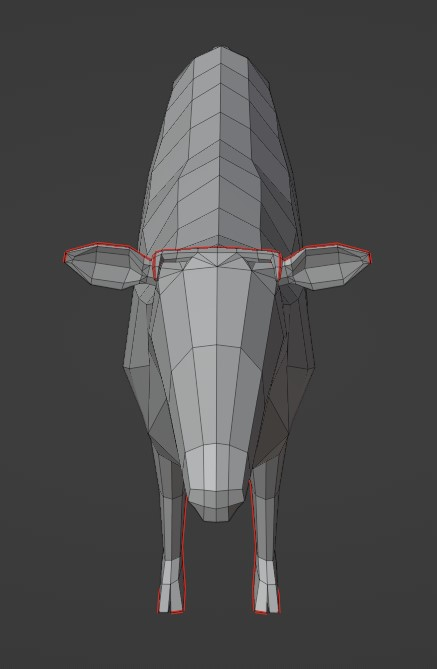

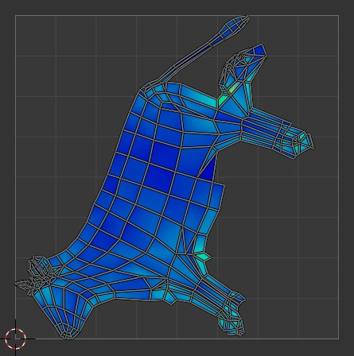 -->

### Speed

#### Concurrent mode

Unwrap multiple meshes simultaneously, making the unwrap much faster. This also has an effect on meshes that need to be separated. The amount of meshes able to be unwrapped at the same time depends on your computer.

You can choose the amount of cores to use. For example, with 8 cores you can unwrap 8 meshes simultaneously. Note that the default amount of cores will probably be the fastest since if you do too many at once, it maxes the CPU and each one gets slower.

#### Timeout

Set a maximum time in minutes for each unwrap. If an unwrap times out, the mesh will be cancelled and moved to the not unwrapped collection. Set to `0` to disable the timeout. This is useful for when unwrapping multiple things at once so if one times out the rest will still unwrap.

With the default OptCuts engine, the partial result will be kept on timeout.

#### Stack Similar

Finds repeated mesh pieces and only unwrap one, then copies the uvs to all the others. The uvs will be overlapping to save texture space.

### Grid

- Press `Add Grid` to apply a grid material to all selected objects. The shading mode will be changed to material preview.
- Press the button to the right of the `Add Grid` button to remove the grid material from selected objects. The shading mode will be changed to solid.
- Choose the grid type: `UV` for a standard UV grid, or `Colour` for a coloured UV grid.
- Set the `Resolution` to control the pixel size of the grid texture.
- Turn `Auto Grid` on to automatically add a grid after unwrapping a mesh

### Pack

Packing uses the Blender packing engine.

- Use the `Margin` slider to set the space between UV islands.
- Turn `Combine UVs` on if you want to combine UV maps of multiple objects into a single UV map.
- Turn `Average Islands Scale` on to scale all islands based on their actual space in 3D.
- Turn `Pack After Unwrap` on to automatically pack UVs after each unwrap finishes.

## Engines

### OptCuts

Default CPU engine. Highest quality but can be slow. Includes the UV island operators.

#### Visual Mode

Press to enter visual mode. This will show a real time view of the unwrap as it progresses. You can zoom in or pan to inspect the unwrap. Press `ESC` or Left Click to exit visual mode. If there are multiple meshes unwrapping concurrently, press the arrow keys to switch between viewers.

#### Import UVs

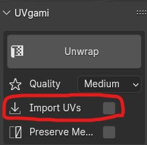

Use the existing UV map on the input mesh as the starting point for the engine unwrap.

Some use cases:

- Deciding where you want some seams
- Finishing a manual unwrap
- Speeding up the unwrap time

<!-- #### Preserve Mesh

- Turn this on to keep the final mesh the same as the original mesh. This is useful when you are working with quads and don't want the final mesh to be triangulated.
- If the mesh had any n-gons, the final result might still have some triangles. There might also be a small amount of extra stretching and overlap. The overlap is easily fixed by hand and can be found by using the Blender `Select Overlap` UV operator.

##### Preserve Mesh: Full

- The final mesh will be fully untriangulated and the seams will be rerouted.
- This might cause some overlap in the UV map, but this can be easily fixed manually

##### Preserve Mesh: Partial

- All areas of the mesh except for the seams will be untriangulated -->

#### Hard Surface

Hard surface mode makes seams go on sharp edges and creases of the mesh. This will cause more islands, but the seams will be hidden on the edges so it's good for hard surface models. Use this on meshes with hard edges like mechanical or man made objects. Don't use it for organic meshes like characters.

#### Weights

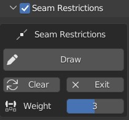

Using weight painting, draw on areas of the mesh to add restrictions to the unwrap. The drawn red areas will have the restrictions while the blue areas won't.

##### Avoid Seams

This mode makes the unwrap avoid putting seams on the painted areas. For example you can use this to avoid putting seams on a characters face.

This option will cause the unwrap to take longer so you can combine it with proxy mode to speed it up.

###### Attribution for 3D models: <!-- omit in toc -->

###### "25 Animals Pack" (<https://skfb.ly/orQpx>) by MadTrollStudio is licensed under Creative Commons Attribution (<http://creativecommons.org/licenses/by/4.0/>) <!-- omit in toc -->

Before seam restrictions:

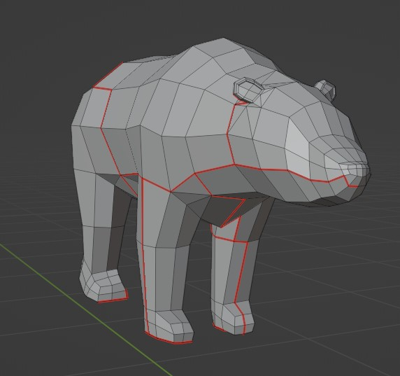

After seam restrictions:

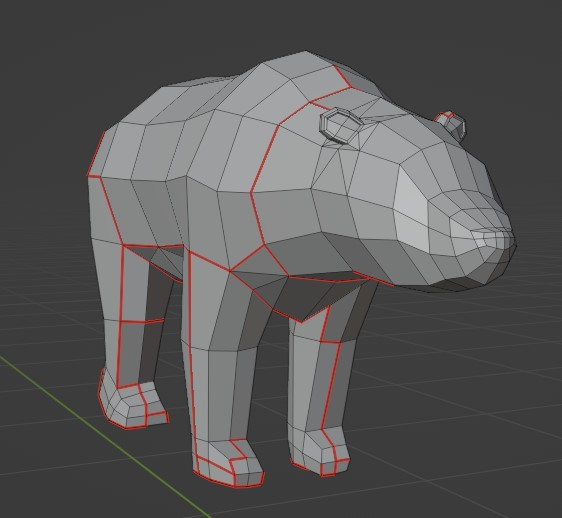

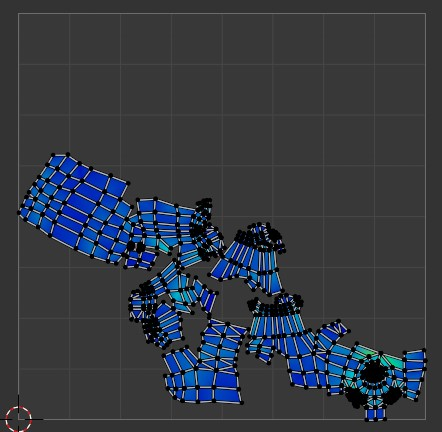

##### Reduce stretching

This mode makes the painted areas have less stretching. To compensate, the non painted areas will have more stretching. Note that you can't use this in combination with proxy mode.

##### Generate Weights

Use these buttons to automatically generate weights.

- `From View`: Paint the visible areas (relative to scene camera). Useful for avoiding seams/stretching on the front of a mesh.
- `Crevices`: Paint the areas in concave crevices. Useful for putting seams/stretching in the hidden crevice areas of a mesh.
- `Both`: Both from view and crevices.

##### Strength

Use the `Strength` slider to control how strictly the seam restrictions are followed. A higher strength will avoid the restricted areas more, but will take longer to finish the unwrap.

#### Proxy (in Speed panel)

Proxy mode unwraps a decimated low poly copy of the mesh then transfers the seams onto the real mesh. This is really useful for unwrapping a slow high poly mesh. You can even unwrap a mesh that is millions of tris like this!

The proxy faces number is the amount of faces of the decimated copy. If the mesh is already under this amount, it won't be decimated, and proxy will have no effect.

#### OptCuts Limitations

- Unwrapping high/medium poly meshes is slow. Use proxy mode to speed up unwrapping dense meshes.
- Some meshes can't be unwrapped due to various reasons. For example, non manifold meshes.

### UV Editor Tools

UVgami also has a panel in the UV editor n-panel for fixing parts of a finished UV map. This uses the OptCuts engine.

These operate on selected islands and faces in the UV editor. You can select multiple faces/islands to do batch operations.

#### Island Operators

The island operators affect the entire UV island.

##### Unwrap Island

Select a face on a UV island and press `Unwrap Island`.

This will re-unwrap just that island.

##### Relax Island

<!-- TODO: example of suzanne mesh -->

Select a face on a UV island and press `Relax Island`.

This will relax all areas with high stretching in the island to reduce stretching. The seams will be unchanged.

##### Combine Islands

Select a face on two UV islands and press `Combine Islands.

This will re-unwrap both those islands as a single combined island. Note that the two islands have to share a seam. You can check this in the 3D view by turning on `UV sync selection` and then check on the 3D model.

#### Area Operators

The area operators affect only the selected faces.

Use the `Expand Area` setting to grow the selection automatically by a number of face rings. This helps so you can be less accurate in your selection and affect a larger area.

##### Unwrap Area

Re-unwrap the selected faces, adding cuts/seams if necessary.

##### Relax Area

Relax the selected faces to reduce stretching. The seams will stay the same.

### PartUV

PartUV uses the GPU and needs CUDA (Windows or Linux only). PartUV makes fewer islands and can be faster on dense meshes.

#### Segmentation mode

PartUV AI segmentation can't be used commercially (NVIDIA license).

- AI (5 gb): Uses PartField which is an AI model to do the segmentation which has the best results. This results in less seams.
- Geometric (200 mb): Finds seams from the mesh surface shape. Fast and decent results.

### xatlas

xatlas is a CPU engine that is good for making quick uvs for baking lightmaps and texture painting. xatlas is very fast but will result in more islands/seams than Optcuts and PartUV. Though it can sometimes still have better results than Blender smart UV project.

### Preferences

In the preferences you can install and delete engines and change some options.

#### Autosave

Automatically save the Blender file before unwrapping.

#### Show Popup

Show a popup when all meshes are finished unwrapping. This might contain other information like if any objects were invalid or if there were any errors.

#### Progress Bar Option

Show a [progress bar](#progress-bar) while unwrapping.

#### Reset Settings

Reset all UVgami preferences and panel settings to their default values.