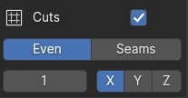

# UVgami User Guide <!-- omit in toc -->

UVgami is a Blender add-on that allows you to easily unwrap your meshes with a single button click.

Versions:

- Windows
- Linux (Ubuntu 20.04.6 and higher) RECOMMENDED (FASTER)

Blender 2.9+

[How to use Linux version on Windows](#linux-faster-version-on-windows)

## Table of Contents <!-- omit in toc -->

- [Installation](#installation)
  - [Blender Add-on](#blender-add-on)
  - [UVgami Engine](#uvgami-engine)
- [Instructions](#instructions)
  - [Unwrap a Mesh](#unwrap-a-mesh)
  - [Unwrap Buttons](#unwrap-buttons)
    - [Visual Mode](#visual-mode)
    - [Stop](#stop)
    - [Cancel](#cancel)
  - [Batch Unwrap](#batch-unwrap)
  - [Joined Objects](#joined-objects)
  - [Progress Bar](#progress-bar)
  - [Main Panel](#main-panel)
    - [Quality](#quality)
    - [Import UVs](#import-uvs)
    - [Preserve Mesh](#preserve-mesh)
      - [Preserve Mesh: Full](#preserve-mesh-full)
      - [Preserve Mesh: Partial](#preserve-mesh-partial)
  - [Seam Restrictions](#seam-restrictions)
  - [Symmetry](#symmetry)
  - [Speed](#speed)
    - [Concurrent mode](#concurrent-mode)
    - [Finish percentage](#finish-percentage)
    - [Cuts](#cuts)
      - [Even](#even)
      - [Seams](#seams)
  - [Grid](#grid)
  - [Pack](#pack)
  - [UV Operations](#uv-operations)
    - [Show Seams](#show-seams)
    - [Unwrap Sharp](#unwrap-sharp)
    - [Mark Seams Sharp](#mark-seams-sharp)
    - [View UVs](#view-uvs)
  - [Info](#info)
  - [Preferences](#preferences)
    - [Autosave (recommended)](#autosave-recommended)
    - [Show Popup](#show-popup)
    - [Progress Bar Option](#progress-bar-option)
    - [Info Option](#info-option)
    - [Invalid Collection](#invalid-collection)
    - [Input Cleanup](#input-cleanup)
    - [Viewer Workspace](#viewer-workspace)
  - [Linux (Faster) Version on Windows](#linux-faster-version-on-windows)
    - [WSL Installation](#wsl-installation)
- [Limitations](#limitations)
  - [High Poly Meshes](#high-poly-meshes)
  - [Triangulation](#triangulation)
  - [Invalid Objects](#invalid-objects)

## Installation

Download the add-on [here](https://github.com/DanielBoxer/UVgami/releases/latest)

### Blender Add-on

- Download `UVgami.zip`
- In the Blender Preferences menu, go to the Add-ons tab and click Install
- Select the `UVgami` ZIP folder (make sure not to extract it) and click `Install Add-on`
- Activate UVgami by checking the box

### UVgami Engine

- Download `Engine.zip`
- Unzip the folder
- Move the `Windows` or the `Linux` folder to a place where you keep applications. This can be anywhere on your filesystem
- In Blender, open UVgami preferences and select the engine path

## Instructions

### Unwrap a Mesh

- Press the `Unwrap` button

- If an unwrap is already active, you can still add new items to the queue

### Unwrap Buttons

#### Visual Mode

Press to enter visual mode. This will show a real time view of the unwrap as it progresses. All keyboard and mouse input will be blocked. Press `ESC` to exit visual mode.

#### Stop

Stop the unwrap and get the partly finished UV map.

#### Cancel

Cancel the unwrap and discard the UV map.

### Batch Unwrap

- Pressing unwrap with more than one object selected will add them all to the unwrap queue
- Most UVgami buttons will operate on all selected objects

### Joined Objects

- If an object is made up of joined together objects, each piece of the object will be unwrapped separately and later joined together
- This will show up as a group in the ui

### Progress Bar

- The progress bar will appear in the bottom left corner of the 3D viewport
- The colours correspond to the UV stretching in the current unwrap
  - Blue: Low stretching
  - Green: Medium stretching
  - Red: High stretching
- A progress bar with almost all blue doesn't necessarily mean that the unwrap will finish soon. Sometimes there is not much stretching, but the seams need adjustment to get the best result.

### Main Panel

#### Quality

Increasing the unwrap quality will produce a UV map with less stretching. This also will make the unwrap take longer, so it's recommended to keep it at medium.

#### Import UVs

Use the existing UV map on the input mesh as the starting point.

Some use cases:

- Deciding where you want some seams
- Finishing a manual unwrap
- Speeding up the unwrap time

#### Preserve Mesh

- Turn this on to keep the final mesh the same as the original mesh. This is useful when you are working with quads and don't want the final mesh to be triangulated.

##### Preserve Mesh: Full

- The final mesh will be fully untriangulated and the seams will be rerouted.
- This might cause some overlap in the UV map, but this can be easily fixed manually

##### Preserve Mesh: Partial

- All areas of the mesh except for the seams will be untriangulated

### Seam Restrictions

#### Draw on areas of the mesh you don't want seams added <!-- omit in toc -->

- Press `Draw` to start drawing on the mesh
- Red areas will be avoided and will have no seams

##### Attribution for 3D models: <!-- omit in toc -->

###### "25 Animals Pack" (<https://skfb.ly/orQpx>) by MadTrollStudio is licensed under Creative Commons Attribution (<http://creativecommons.org/licenses/by/4.0/>) <!-- omit in toc -->

Before seam restrictions:

After seam restrictions:

### Symmetry

Use symmetry when you have a symmetrical mesh. The more axes selected, the faster the unwrap will be.

- Select multiple axes by holding `Shift`
- Deselect by holding `Shift`
- If overlap is turned on, the symmetrical uvs will overlap and merge. This is good if you want your texture mirrored. Unchecking overlap will result in a seam down the set axes.
- Press preview to add a plane on the set axes. This is only for making sure you have selected the correct axes.

### Speed

#### Concurrent mode

Unwrap multiple meshes simultaneously, making the unwrap much faster. This also has an effect on meshes that need to be separated. The amount of meshes able to be unwrapped at the same time depends on your computer.

You can choose the amount of cores to use below. For example, with 8 cores you can unwrap 8 meshes simultaneously.

#### Finish percentage

Stop the unwrap early based on the amount of stretching.

#### Cuts

(should be used with concurrent mode on)

This splits the mesh apart, unwraps the pieces separately, then joins them together when finished. Doing this will make the unwrap much faster and is very useful for high poly meshes.

Sometimes there are errors when cuts is turned on. This is because bisecting the mesh can produce invalid geometry.

##### Even

Make even cuts along the XYZ axes of the mesh. The more cuts made, the faster the unwrap will be. Keep in mind there will be seams along the cuts so you wouldn't want to do too many.

Hold shift to select or deselect multiple axes.

##### Seams

This is for if you want more control over where the cuts will be. You can manually mark seams and the mesh will be cut there.

### Grid

- Press `Add Grid` to apply a grid material to all selected objects. The shading mode will be changed to material preview.
- Press the button to the right of the `Add Grid` button to remove the grid material from selected objects. The shading mode will be changed to solid.
- Turn `Auto Grid` on to automatically add a grid after unwrapping a mesh

### Pack

Packing uses the Blender packing engine. This is just to make packing a bit easier.

- Turn `Combine UVs` on if you want to combine UV maps of multiple objects into a single UV map.
- Turn `Average Islands Scale` on to scale all islands based on their actual space in 3D.

### UV Operations

#### Show Seams

Make the seams of all selected objects follow their UVs. Seams won't automatically be visible after an unwrap so you can use this to see them.

#### Unwrap Sharp

This is an interactive operator for hard surface models. It combines some Blender features to unwrap an object by sharp edges. You can use the `Sharpness` slider to change the angle, and the unwrap will be updated.

If the object is very high poly, the slider will get too slow to use. You can either click it to input a value or turn preview mode on.

Preview mode only marks seams and doesn't unwrap the mesh. Once you have good seams in preview mode, turn preview mode off and click `Unwrap Sharp` again.

#### Mark Seams Sharp

Mark all seams as sharp

#### View UVs

Open the UV viewer for the selected object. Click to exit the viewer.

### Info

The info panel shows information about past unwraps. Any errors will also be shown here. If you don't need this, it can be turned off in the preferences.

- Press `Copy` to copy all info to the clipboard
- Press `Clear` to clear all info

### Preferences

#### Autosave (recommended)

Save the Blender file before and after unwrapping to avoid losing work.

#### Show Popup

Show a popup when all meshes are finished unwrapping. This might contain other information like if any objects were invalid or if there were any errors.

#### Progress Bar Option

Show a [progress bar](#progress-bar) in the 3D view while unwrapping.

#### Info Option

Show information about previous unwraps in the info panel.

#### Invalid Collection

Add all invalid meshes to a collection.

#### Input Cleanup

The action to perform on the original input mesh.

- None: Leave the input mesh as it is
- Hide: Hide the original input mesh
- Delete: Delete the original input mesh

#### Viewer Workspace

The name of the workspace that will be opened when viewing an unwrap. If this is empty, the UV editor will be opened instead.

### Linux (Faster) Version on Windows

- The Linux version can be used on Windows by installing WSL (Windows Subsystem for Linux)
- This version is faster for high poly meshes
- For example, a mesh with 35K tris:
  - Windows: 40 minutes
  - Linux: 3 minutes

#### WSL Installation

[YouTube Tutorial for WSL Installation](https://youtu.be/FQ6ahcJOVz0?t=30) 0:30 - 2:12

1. Open the Windows start menu
2. Search for `Windows PowerShell`

3. Right click on `Windows PowerShell`
4. Click `Run as administrator`

5. When prompted to make changes to your device, click Yes
6. Type `wsl --install` in the Windows PowerShell terminal and press enter
7. Once installation is complete, restart your computer. An Ubuntu window will appear to finish the installation
8. Enter your new Linux username and password. This can be anything, it won't be needed again. Note: when typing in your password, no characters will appear in the terminal
9. Open Blender and go to UVgami preferences
10. Select the Linux engine instead of Windows in the `Engine Path` field (the Linux file doesn't end in .exe)
11. Press `Unwrap` to complete the rest of the setup automatically. This will take a few seconds for the first unwrap with WSL

**Important: Whenever you get a new version of the engine, you need to press the `Setup WSL` button. If you don't, the older version will be used when you use WSL**

## Limitations

### High Poly Meshes

Unwrapping high/medium poly meshes is very slow

Current ways to speed up the unwrap:

- [Use the Linux version if on Windows](#linux-faster-version-on-windows)
- Turn `Concurrent` mode on and increase the max cores
- Turn `Symmetry` on if the mesh is symmetrical
- Don't add too many seam restrictions
- Use the cuts option
- Consider lowering the quality or setting the finish percent lower. Though this isn't recommended as the final unwrap will probably have too much stretching.

### Triangulation

- The mesh currently needs to be triangulated in order to unwrap it (the add-on will do this automatically)
- There is an option to convert the mesh back to how it was originally after the unwrap, but if the mesh had any n-gons, the final result might still have some triangles. There might also be a small amount of extra stretching and overlap. The overlap is easily fixed by hand and can be found by using the Blender `Select Overlap` UV operator.

### Invalid Objects

- The unwrapper can't unwrap some objects for various reasons
- If it can't unwrap an object, you will be notified, or if the object is part of a separated object, it will be moved to a "Invalid Objects" collection
- For example, the Suzanne monkey head is invalid because it's non manifold. Unwrapping it will have this result, where the eyes are unwrapped succesfully, and the head was not:

In this case, the problem is this area, which when fixed, will unwrap properly:

